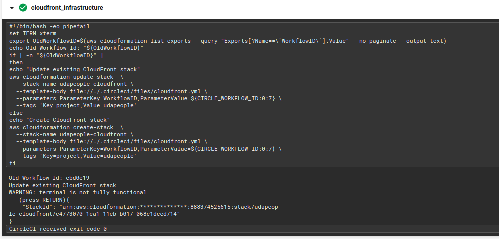
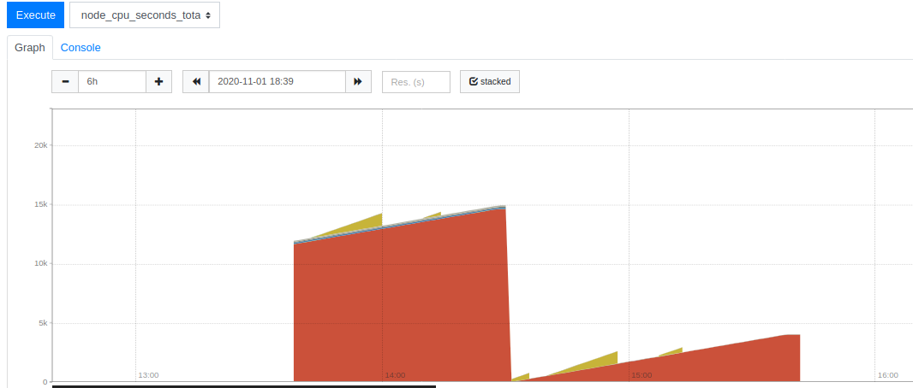

Section 2 - Utilize Deployment Strategies to Design and Build CI/CD Pipelines that Support Continuous Delivery Processes
1. Build Phase

2. Test Phase

3. Analyze Phase

4. Alerts

Section 3 - Utilize a Configuration Management Tool to Accomplish Deployment to Cloud-Based Servers
1. Infrastructure Phase

2. Deploy Phase

4. Rollback Phase

5. Promotion Phase

6. Cleanup Phase

Other Considerations

Section 4 - Surface Critical Server Errors for Diagnosis Using Centralized Logging
1. Setup Back-End Monitoring

2. Setup Alerts

